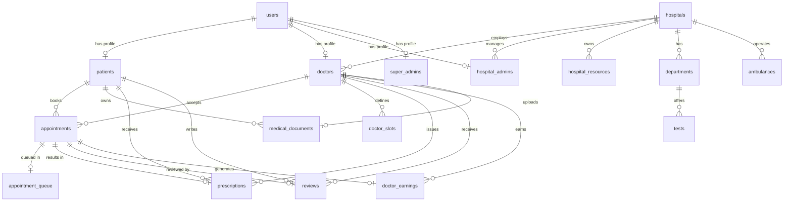

# MediConnect BD 3.0 - Database Management System Project Report

**Project Title:** MediConnect BD - AI-Powered Healthcare Management Platform  
**Course:** Database Management Systems (DBMS)  
**Academic Year:** 2025-2026  
**Date:** January 24, 2026  
**Version:** 3.0

---

## Executive Summary

MediConnect BD 3.0 is a comprehensive, full-stack healthcare management platform designed specifically for the healthcare ecosystem in Bangladesh. The system connects patients, doctors, hospital administrators, and super administrators in a unified digital platform with real-time communication, intelligent queue management, and AI-powered assistance.

This project demonstrates advanced database design principles, normalized relational schema (3NF compliance), real-time data synchronization, role-based access control (RBAC), and a modern 3-tier architecture that separates presentation, business logic, and data layers.

**Key Statistics:**
- **Database Tables:** 16 normalized tables
- **User Roles:** 4 distinct roles (Patient, Doctor, Hospital Admin, Super Admin)
- **API Endpoints:** 60+ RESTful endpoints
- **Real-Time Features:** WebSocket-based live notifications and queue tracking
- **Lines of Code:** ~15,000+ (Backend: ~8,000, Frontend: ~7,000)

---

## Table of Contents

1. [Project Overview](#1-project-overview)
2. [System Architecture](#2-system-architecture)
3. [Database Design](#3-database-design)
4. [Technology Stack](#4-technology-stack)
5. [Implemented Features](#5-implemented-features)
6. [API Endpoints](#6-api-endpoints)
7. [Security Implementation](#7-security-implementation)
8. [Real-Time Functionality](#8-real-time-functionality)
9. [User Interfaces](#9-user-interfaces)
10. [Testing and Validation](#10-testing-and-validation)
11. [Future Enhancements](#11-future-enhancements)
12. [Conclusion](#12-conclusion)

---

## 1. Project Overview

### 1.1 Problem Statement

The healthcare system in Bangladesh faces several challenges:
- Lack of centralized patient record management
- Inefficient appointment booking systems
- Long waiting times with no queue visibility
- Limited accessibility to specialized medical care
- Fragmented communication between patients and healthcare providers
- Difficulty in emergency service coordination

### 1.2 Solution

MediConnect BD 3.0 addresses these challenges through:
- **Centralized Platform:** Single platform for all healthcare stakeholders
- **Real-Time Queue Management:** Live tracking of appointment queues
- **Digital Medical Records:** Secure storage and sharing of medical documents
- **AI-Powered Assistance:** Integrated chatbot for health inquiries
- **Emergency Services:** Quick access to ambulances and emergency contacts
- **Multi-Tenancy Support:** Hospital-specific data isolation
- **Telemedicine Ready:** Support for both physical and virtual consultations

### 1.3 Project Objectives

1. Design and implement a normalized relational database (3NF)
2. Create a scalable, secure backend API with JWT authentication
3. Develop intuitive user interfaces for all stakeholders
4. Implement real-time features using WebSocket technology
5. Ensure data privacy and role-based access control
6. Support hospital resource management and analytics
7. Enable comprehensive medical record management

---

## 2. System Architecture

### 2.1 Architectural Pattern

The system employs a **3-Tier Architecture** with clear separation of concerns:

```
┌─────────────────────────────────────────────────────────────┐
│                    PRESENTATION LAYER                        │
│  ┌──────────────┐  ┌──────────────┐  ┌──────────────┐      │
│  │  Web Client  │  │ Mobile App   │  │   Admin      │      │
│  │  (React +    │  │  (Future)    │  │   Portal     │      │
│  │   Vite)      │  │              │  │              │      │
│  └──────────────┘  └──────────────┘  └──────────────┘      │
└─────────────────────────────────────────────────────────────┘
                         ▼ HTTPS/WSS ▼
┌─────────────────────────────────────────────────────────────┐
│                    BUSINESS LOGIC LAYER                      │
│  ┌──────────────────────────────────────────────────────┐   │
│  │         Express.js API Server (Node.js)              │   │
│  │  ┌────────────┐  ┌────────────┐  ┌────────────┐    │   │
│  │  │Controllers │  │Middleware  │  │  Services   │    │   │
│  │  │  (14)      │  │(Auth,RBAC) │  │(Notification│    │   │
│  │  └────────────┘  └────────────┘  └────────────┘    │   │
│  └──────────────────────────────────────────────────────┘   │
│  ┌──────────────────────────────────────────────────────┐   │
│  │         Socket.IO WebSocket Server                   │   │
│  │         (Real-time notifications & queue)            │   │
│  └──────────────────────────────────────────────────────┘   │
└─────────────────────────────────────────────────────────────┘
                         ▼ SQL Queries ▼
┌─────────────────────────────────────────────────────────────┐
│                      DATA LAYER                              │
│  ┌──────────────────┐  ┌──────────────────────────────┐    │
│  │  MySQL Database  │  │    File Storage System       │    │
│  │   (16 Tables)    │  │    (Medical Documents)       │    │
│  └──────────────────┘  └──────────────────────────────┘    │
└─────────────────────────────────────────────────────────────┘
```

### 2.2 Key Architectural Decisions

1. **Decoupled Frontend and Backend:**
   - Frontend and backend run as independent services
   - Communication via RESTful JSON APIs
   - Enables independent scaling and deployment

2. **Stateless Authentication:**
   - JWT (JSON Web Tokens) for authentication
   - No server-side session storage required
   - Scalable across multiple server instances

3. **Real-Time Communication:**
   - Socket.IO for bidirectional WebSocket connections
   - User-specific rooms for targeted notifications
   - Queue-specific rooms for live updates

4. **Database Connection Pooling:**
   - Efficient connection management
   - Prevents connection exhaustion
   - Improves performance under load

### 2.3 Data Flow

**Typical Request Flow:**
1. Client sends HTTP request with JWT token
2. Auth middleware validates token
3. RBAC middleware checks user permissions
4. Controller processes business logic
5. Database query executed via connection pool
6. Response sent back to client as JSON
7. If applicable, Socket.IO emits real-time updates

---

## 3. Database Design

### 3.1 Database Overview

- **DBMS:** MySQL 8.0+
- **Total Tables:** 16
- **Normalization:** Third Normal Form (3NF)
- **Character Set:** UTF8MB4 (supports international characters and emojis)
- **Storage Engine:** InnoDB (ACID compliance, foreign key support)

### 3.2 Entity Relationship Diagram (ERD)



### 3.3 Tables Description

#### **3.3.1 User Management Tables (5 tables)**

##### **users** (Base authentication table)
- **Purpose:** Central authentication and role management
- **Key Fields:** id, email, password (hashed), role, is_active, is_verified
- **AUTO_INCREMENT:** Starts at 1000
- **Indexes:** email, role, is_active

##### **patients**
- **Purpose:** Patient-specific profile information
- **Key Fields:** full_name, phone, address, date_of_birth, blood_group, weight, height
- **Privacy Fields:** share_medical_history, is_visible_in_search
- **AUTO_INCREMENT:** Starts at 20001 (P-20001, P-20002, etc.)
- **Relationship:** One-to-One with users

##### **doctors**
- **Purpose:** Doctor profile and credentials
- **Key Fields:** full_name, specialization, bmdc_number, experience_years, consultation_fee
- **Performance Fields:** rating, review_count
- **AUTO_INCREMENT:** Starts at 10001 (D-10001, D-10002, etc.)
- **Relationship:** Belongs to hospital, one-to-one with users

##### **hospital_admins**
- **Purpose:** Hospital administrator accounts
- **Key Fields:** full_name, hospital_id, designation
- **AUTO_INCREMENT:** Starts at 40001
- **Relationship:** Belongs to one hospital

##### **super_admins**
- **Purpose:** Platform super administrators
- **Key Fields:** full_name, permissions (JSON)
- **AUTO_INCREMENT:** Starts at 50001
- **Relationship:** System-wide access

#### **3.3.2 Hospital Operations Tables (5 tables)**

##### **hospitals**
- **Purpose:** Hospital registration and information
- **Key Fields:** name, address, city, type, license_number, is_approved
- **AUTO_INCREMENT:** Starts at 30001 (H-30001, H-30002, etc.)
- **Indexes:** city, name, is_approved

##### **hospital_resources**
- **Purpose:** Real-time hospital bed/resource availability
- **Resource Types:** ICU, CCU, CABIN, GENERAL_WARD
- **Key Fields:** resource_type, total_capacity, available
- **Constraints:** available <= total_capacity, unique (hospital_id, resource_type)
- **AUTO_INCREMENT:** Starts at 60001

##### **departments**
- **Purpose:** Hospital departments (Cardiology, Neurology, etc.)
- **Key Fields:** name, description, is_active
- **AUTO_INCREMENT:** Starts at 70001

##### **tests**
- **Purpose:** Medical tests offered by departments
- **Key Fields:** name, cost, duration_minutes, is_available
- **AUTO_INCREMENT:** Starts at 80001

##### **ambulances**
- **Purpose:** Ambulance fleet management
- **Key Fields:** vehicle_number, driver_name, ambulance_type, status, current_location
- **Types:** BASIC, ADVANCED, ICU
- **Status:** AVAILABLE, BUSY, MAINTENANCE
- **AUTO_INCREMENT:** Starts at 90001

#### **3.3.3 Appointment & Queue System Tables (3 tables)**

##### **appointments**
- **Purpose:** Core appointment booking system
- **Key Fields:** patient_id, doctor_id, appointment_date, appointment_time, consultation_type, status
- **Status Values:** PENDING, CONFIRMED, IN_PROGRESS, COMPLETED, CANCELLED
- **Consultation Types:** PHYSICAL, TELEMEDICINE
- **Timestamps:** started_at, completed_at
- **Indexes:** (doctor_id, appointment_date), patient_id, status

##### **appointment_queue**
- **Purpose:** Real-time queue management for doctor appointments
- **Key Fields:** appointment_id, queue_number, queue_date, status
- **Status Values:** WAITING, IN_PROGRESS, COMPLETED, SKIPPED
- **Timestamps:** called_at, started_at, completed_at
- **Unique Constraint:** appointment_id (one queue entry per appointment)

##### **doctor_slots**
- **Purpose:** Doctor availability schedule (recurring weekly)
- **Key Fields:** doctor_id, day_of_week, start_time, end_time, consultation_type, slot_duration_minutes, max_patients
- **Days:** MONDAY through SUNDAY
- **Indexes:** (doctor_id, day_of_week, is_active)

#### **3.3.4 Medical Records & Privacy Tables (2 tables)**

##### **medical_documents**
- **Purpose:** Patient medical document storage
- **Key Fields:** patient_id, filename, filepath, document_type, visibility, uploaded_by_doctor_id
- **Document Types:** LAB_REPORT, PRESCRIPTION, XRAY, SCAN, OTHER
- **Visibility:** PUBLIC (shared with doctors), PRIVATE (patient-only)
- **Indexes:** (patient_id, visibility), document_type

##### **prescriptions**
- **Purpose:** Digital prescription management
- **Key Fields:** patient_id, doctor_id, medication_name, dosage, frequency, duration, instructions, visibility
- **Privacy:** PUBLIC/PRIVATE visibility control
- **Indexes:** (patient_id, visibility), doctor_id, issue_date

#### **3.3.5 Financial & Feedback Tables (2 tables)**

##### **doctor_earnings**
- **Purpose:** Track doctor consultation revenue
- **Key Fields:** doctor_id, appointment_id, amount, consultation_type, payment_status, earned_date
- **Payment Status:** PENDING, COMPLETED
- **Indexes:** (doctor_id, earned_date), consultation_type

##### **reviews**
- **Purpose:** Patient feedback and doctor ratings
- **Key Fields:** patient_id, doctor_id, appointment_id, rating, comment, is_verified
- **Rating:** 1-5 stars (CHECK constraint)
- **Unique Constraint:** (patient_id, appointment_id) - one review per appointment
- **Indexes:** doctor_id, rating

### 3.4 Normalization & Data Integrity

#### **3NF Compliance:**
1. ✅ **First Normal Form (1NF):** All fields are atomic, no repeating groups
2. ✅ **Second Normal Form (2NF):** All non-key attributes fully depend on the primary key
3. ✅ **Third Normal Form (3NF):** No transitive dependencies

#### **Referential Integrity:**
- **Foreign Keys:** All relationships enforced with FOREIGN KEY constraints
- **CASCADE Operations:** 
  - `ON DELETE CASCADE` for dependent records (e.g., delete user → delete doctor profile)
  - `ON DELETE SET NULL` for optional references (e.g., delete doctor → keep prescription but nullify doctor_id)

#### **Data Validation:**
- **CHECK Constraints:** rating BETWEEN 1 AND 5, available <= total_capacity
- **UNIQUE Constraints:** email (users), bmdc_number (doctors), license_number (hospitals)
- **ENUM Types:** Controlled vocabularies for status, roles, resource types
- **NOT NULL:** Required fields enforced at database level

#### **Performance Optimization:**
- **Indexes:** 25+ strategic indexes on frequently queried columns
- **Composite Indexes:** (doctor_id, appointment_date), (hospital_id, status)
- **AUTO_INCREMENT Ranges:** Unique ID ranges prevent collisions

### 3.5 Unique ID Range Strategy

To ensure globally unique, human-readable IDs:

| Entity Type      | ID Range     | Example IDs            |
|------------------|--------------|------------------------|
| Users            | 1000+        | 1000, 1001, 1002       |
| Doctors          | 10001+       | D-10001, D-10002       |
| Patients         | 20001+       | P-20001, P-20002       |
| Hospitals        | 30001+       | H-30001, H-30002       |
| Hospital Admins  | 40001+       | A-40001, A-40002       |
| Super Admins     | 50001+       | S-50001, S-50002       |
| Resources        | 60001+       | 60001, 60002           |
| Departments      | 70001+       | 70001, 70002           |
| Tests            | 80001+       | 80001, 80002           |
| Ambulances       | 90001+       | 90001, 90002           |

---

## 4. Technology Stack

### 4.1 Backend Technologies

| Technology       | Version | Purpose                                    |
|------------------|---------|--------------------------------------------|
| **Node.js**      | 18+     | JavaScript runtime environment             |
| **Express.js**   | 4.21.2  | Web framework for RESTful APIs             |
| **MySQL**        | 8.0+    | Relational database management system      |
| **mysql2**       | 3.12.0  | MySQL client with promise support          |
| **Socket.IO**    | 4.8.1   | Real-time bidirectional communication      |
| **bcrypt**       | 6.0.0   | Password hashing (10 rounds)               |
| **jsonwebtoken** | 9.0.2   | JWT creation and validation                |
| **multer**       | 1.4.5   | File upload handling (multipart/form-data) |
| **cors**         | 2.8.5   | Cross-Origin Resource Sharing              |
| **dotenv**       | 16.4.5  | Environment variable management            |
| **@faker-js/faker** | 9.2.0 | Test data generation for seeders        |

### 4.2 Frontend Technologies

| Technology          | Version | Purpose                                 |
|---------------------|---------|-----------------------------------------|
| **React**           | 19.2.0  | UI component library                    |
| **TypeScript**      | 5.8.2   | Type-safe JavaScript                    |
| **Vite**            | 6.2.0   | Fast build tool and dev server          |
| **Socket.IO Client**| 4.8.1   | Real-time client library                |
| **Lucide React**    | 0.555.0 | Modern icon library                     |
| **Recharts**        | 3.5.0   | Charts and data visualization           |
| **@google/genai**   | 1.30.0  | Google Gemini AI integration            |

### 4.3 Development Tools

- **Nodemon** (3.1.9): Auto-reload during development
- **Git**: Version control
- **VSCode**: Primary IDE
- **Postman/Thunder Client**: API testing
- **MySQL Workbench**: Database management

### 4.4 System Requirements

**Server Requirements:**
- Node.js >= 18.x
- npm >= 9.x
- MySQL Server >= 8.0
- Minimum 2GB RAM
- 5GB disk space (for database and uploads)

**Client Requirements:**
- Modern web browser (Chrome, Firefox, Edge, Safari)
- JavaScript enabled
- Internet connection for WebSocket

---

## 5. Implemented Features

### 5.1 Patient Features

#### **5.1.1 Account Management**
- ✅ Patient registration with email validation
- ✅ Secure login with JWT authentication
- ✅ Profile management (name, phone, address, DOB, blood group, weight, height)
- ✅ Privacy controls (share medical history, search visibility)
- ✅ Password change functionality

#### **5.1.2 Doctor Discovery & Booking**
- ✅ Search doctors by specialization
- ✅ View doctor profiles (qualifications, experience, fees, ratings)
- ✅ View doctor availability (time slots by day of week)
- ✅ Book appointments for available slots
- ✅ View appointment history with status tracking
- ✅ Cancel pending appointments

#### **5.1.3 Queue Management**
- ✅ Real-time queue position tracking
- ✅ Live updates when queue moves
- ✅ Estimated wait time calculation
- ✅ Notification when it's patient's turn
- ✅ Queue status visibility (WAITING, IN_PROGRESS, COMPLETED)

#### **5.1.4 Medical Records**
- ✅ Upload medical documents (PDF, images)
- ✅ Categorize documents (Lab Report, X-ray, Scan, Other)
- ✅ Set document visibility (Public/Private)
- ✅ View and download uploaded documents
- ✅ View prescriptions from doctors
- ✅ View vitals history (blood pressure, temperature, etc.)

#### **5.1.5 Doctor Reviews & Ratings**
- ✅ Rate doctors (1-5 stars) after appointments
- ✅ Write detailed review comments
- ✅ View other patient reviews
- ✅ One review per appointment constraint

#### **5.1.6 Real-Time Notifications**
- ✅ Appointment confirmation notifications
- ✅ Queue position update notifications
- ✅ New prescription notifications
- ✅ Document upload notifications from doctor
- ✅ Notification bell with unread count

#### **5.1.7 AI Health Assistant**
- ✅ AI chatbot powered by Google Gemini
- ✅ Health-related query answering
- ✅ Symptom checker guidance
- ✅ Medical information lookup

#### **5.1.8 Emergency Services**
- ✅ Emergency contact quick dial
- ✅ Nearby ambulance search
- ✅ Emergency service information

### 5.2 Doctor Features

#### **5.2.1 Doctor Portal Dashboard**
- ✅ Registration with BMDC number verification
- ✅ Comprehensive profile setup (specialization, qualification, bio, consultation fee)
- ✅ Hospital affiliation selection
- ✅ Appointment overview and statistics
- ✅ Today's appointment list with patient details

#### **5.2.2 Schedule Management**
- ✅ Create recurring time slots (day of week, start/end time)
- ✅ Set consultation type (Physical, Telemedicine, Both)
- ✅ Define slot duration and max patients per slot
- ✅ Update existing slots
- ✅ Activate/deactivate slots
- ✅ Delete slots

#### **5.2.3 Queue Dashboard**
- ✅ Real-time queue visualization
- ✅ Call next patient button
- ✅ Mark patient as in-progress
- ✅ Complete consultation button
- ✅ Skip patient option
- ✅ Queue auto-refresh with Socket.IO

#### **5.2.4 Patient Medical History Access**
- ✅ View patient profile and demographics
- ✅ Access patient medical documents (respecting privacy settings)
- ✅ Download patient documents
- ✅ View patient's prescription history
- ✅ View patient vitals (BP, temperature, heart rate)
- ✅ Privacy-aware data filtering (PUBLIC/PRIVATE visibility)

#### **5.2.5 Prescription Management**
- ✅ Create digital prescriptions for patients
- ✅ Specify medication name, dosage, frequency, duration
- ✅ Add instructions and notes
- ✅ Set prescription visibility
- ✅ Link prescriptions to appointments
- ✅ View prescription history

#### **5.2.6 Document Management**
- ✅ Upload documents on behalf of patients
- ✅ Categorize uploaded documents
- ✅ View patient document library

#### **5.2.7 Feedback & Reviews**
- ✅ View patient reviews and ratings
- ✅ See average rating and rating distribution
- ✅ Read individual review comments
- ✅ Rating analytics display

#### **5.2.8 Appointment Management**
- ✅ View appointment requests
- ✅ Confirm/reject pending appointments
- ✅ Update appointment status
- ✅ View appointment history
- ✅ Filter by date and status

### 5.3 Hospital Admin Features

#### **5.3.1 Admin Portal Dashboard**
- ✅ Hospital-specific single-tenancy login
- ✅ Dashboard with hospital overview
- ✅ Real-time statistics (doctors, resources, appointments)
- ✅ Quick action buttons

#### **5.3.2 Doctor Management**
- ✅ View all hospital doctors
- ✅ Add new doctors to hospital
- ✅ Update doctor information
- ✅ Set doctor status (Active, Inactive, On Leave)
- ✅ Remove doctors from hospital
- ✅ View doctor specializations and ratings

#### **5.3.3 Hospital Resource Management**
- ✅ Real-time bed availability tracking
- ✅ Manage ICU, CCU, CABIN, GENERAL_WARD capacities
- ✅ Update total capacity for each resource type
- ✅ Update available beds in real-time
- ✅ Resource utilization visualization
- ✅ Automatic validation (available <= total_capacity)

#### **5.3.4 Department Management**
- ✅ Create hospital departments
- ✅ Update department details
- ✅ Activate/deactivate departments
- ✅ Delete departments
- ✅ View department list

#### **5.3.5 Medical Test Management**
- ✅ Add medical tests to departments
- ✅ Set test pricing and duration
- ✅ Update test information
- ✅ Toggle test availability
- ✅ Delete tests
- ✅ View tests by department

#### **5.3.6 Ambulance Fleet Management**
- ✅ Register ambulances (vehicle number, driver info)
- ✅ Set ambulance type (BASIC, ADVANCED, ICU)
- ✅ Update ambulance status (AVAILABLE, BUSY, MAINTENANCE)
- ✅ Track current location
- ✅ Update driver information
- ✅ Remove ambulances

#### **5.3.7 Queue Monitoring**
- ✅ Live queue dashboard for all hospital doctors
- ✅ Real-time queue position tracking
- ✅ Patient status monitoring
- ✅ Queue analytics and wait time statistics

### 5.4 Super Admin Features

#### **5.4.1 Platform Management**
- ✅ Super admin login and authentication
- ✅ System-wide user management
- ✅ View all hospitals registered
- ✅ Approve/reject hospital registrations
- ✅ System analytics dashboard

#### **5.4.2 Hospital Approval System**
- ✅ Review pending hospital registrations
- ✅ Verify license numbers
- ✅ Approve hospitals for platform access
- ✅ Deactivate non-compliant hospitals

#### **5.4.3 User Administration**
- ✅ View all platform users
- ✅ Activate/deactivate user accounts
- ✅ Role management
- ✅ User verification status control

### 5.5 Cross-Cutting Features

#### **5.5.1 Authentication & Authorization**
- ✅ JWT-based stateless authentication
- ✅ Role-based access control (RBAC)
- ✅ Password hashing with bcrypt (10 rounds)
- ✅ Token expiration (30 days)
- ✅ Protected routes with auth middleware
- ✅ Role-specific route protection

#### **5.5.2 Real-Time Communication**
- ✅ Socket.IO WebSocket server
- ✅ User-specific notification rooms (user_{userId})
- ✅ Queue-specific rooms (queue_{doctorId})
- ✅ JWT-based socket authentication
- ✅ Automatic reconnection handling

#### **5.5.3 File Upload System**
- ✅ Multer middleware for file handling
- ✅ File size validation (max 10MB)
- ✅ File type validation (PDF, JPG, PNG)
- ✅ Secure file storage with unique filenames
- ✅ File download with authentication

#### **5.5.4 Data Seeding & Testing**
- ✅ Master seed script for database population
- ✅ Faker.js integration for realistic test data
- ✅ Seeder for patients, doctors, hospitals
- ✅ Appointment seeder with queue generation
- ✅ Medical document seeder
- ✅ Prescription seeder
- ✅ Review and rating seeder
- ✅ Database clear/refresh scripts

---

## 6. API Endpoints

### 6.1 Authentication Endpoints

| Method | Endpoint | Description | Auth Required |
|--------|----------|-------------|---------------|
| POST | `/api/auth/register` | User registration | No |
| POST | `/api/auth/login` | User login (returns JWT) | No |
| GET | `/api/auth/me` | Get current user profile | Yes |
| PUT | `/api/auth/update-profile` | Update user profile | Yes |
| PUT | `/api/auth/change-password` | Change password | Yes |

### 6.2 Patient Endpoints

| Method | Endpoint | Description | Auth Required |
|--------|----------|-------------|---------------|
| GET | `/api/patients/profile` | Get patient profile | Yes (Patient) |
| PUT | `/api/patients/profile` | Update patient profile | Yes (Patient) |
| PUT | `/api/patients/privacy` | Update privacy settings | Yes (Patient) |
| GET | `/api/patients/appointments` | Get patient appointments | Yes (Patient) |
| GET | `/api/patients/medical-history` | Get medical documents | Yes (Patient) |

### 6.3 Doctor Endpoints

| Method | Endpoint | Description | Auth Required |
|--------|----------|-------------|---------------|
| GET | `/api/doctors` | Search/list all doctors | No |
| GET | `/api/doctors/:id` | Get doctor details | No |
| GET | `/api/doctors/:id/reviews` | Get doctor reviews | No |
| GET | `/api/doctors/:id/slots` | Get doctor availability | No |
| GET | `/api/doctors/profile` | Get own doctor profile | Yes (Doctor) |
| PUT | `/api/doctors/profile` | Update doctor profile | Yes (Doctor) |
| GET | `/api/doctors/appointments` | Get doctor appointments | Yes (Doctor) |
| GET | `/api/doctors/earnings` | Get earnings report | Yes (Doctor) |

### 6.4 Appointment Endpoints

| Method | Endpoint | Description | Auth Required |
|--------|----------|-------------|---------------|
| POST | `/api/appointments` | Create appointment | Yes (Patient) |
| GET | `/api/appointments/:id` | Get appointment details | Yes |
| PUT | `/api/appointments/:id` | Update appointment status | Yes (Doctor) |
| DELETE | `/api/appointments/:id` | Cancel appointment | Yes |
| GET | `/api/appointments/my` | Get user's appointments | Yes |

### 6.5 Queue Endpoints

| Method | Endpoint | Description | Auth Required |
|--------|----------|-------------|---------------|
| GET | `/api/queue/doctor/:doctorId` | Get doctor's queue | Yes (Doctor) |
| GET | `/api/queue/patient/:appointmentId` | Get patient queue position | Yes (Patient) |
| PUT | `/api/queue/:queueId/call-next` | Call next patient | Yes (Doctor) |
| PUT | `/api/queue/:queueId/start` | Start consultation | Yes (Doctor) |
| PUT | `/api/queue/:queueId/complete` | Complete consultation | Yes (Doctor) |
| PUT | `/api/queue/:queueId/skip` | Skip patient | Yes (Doctor) |

### 6.6 Slot Management Endpoints

| Method | Endpoint | Description | Auth Required |
|--------|----------|-------------|---------------|
| GET | `/api/slots/doctor/:doctorId` | Get doctor slots | No |
| POST | `/api/slots` | Create time slot | Yes (Doctor) |
| PUT | `/api/slots/:id` | Update time slot | Yes (Doctor) |
| DELETE | `/api/slots/:id` | Delete time slot | Yes (Doctor) |
| GET | `/api/slots/available` | Get available slots | Yes (Patient) |

### 6.7 Document Endpoints

| Method | Endpoint | Description | Auth Required |
|--------|----------|-------------|---------------|
| POST | `/api/documents/upload` | Upload medical document | Yes |
| GET | `/api/documents/patient/:patientId` | Get patient documents | Yes |
| GET | `/api/documents/:id/download` | Download document | Yes |
| PUT | `/api/documents/:id/visibility` | Update visibility | Yes (Patient) |
| DELETE | `/api/documents/:id` | Delete document | Yes |

### 6.8 Prescription Endpoints

| Method | Endpoint | Description | Auth Required |
|--------|----------|-------------|---------------|
| POST | `/api/prescriptions` | Create prescription | Yes (Doctor) |
| GET | `/api/prescriptions/patient/:patientId` | Get patient prescriptions | Yes |
| GET | `/api/prescriptions/:id` | Get prescription details | Yes |
| PUT | `/api/prescriptions/:id` | Update prescription | Yes (Doctor) |
| DELETE | `/api/prescriptions/:id` | Delete prescription | Yes (Doctor) |

### 6.9 Review Endpoints

| Method | Endpoint | Description | Auth Required |
|--------|----------|-------------|---------------|
| POST | `/api/reviews` | Create doctor review | Yes (Patient) |
| GET | `/api/reviews/doctor/:doctorId` | Get doctor reviews | No |
| PUT | `/api/reviews/:id` | Update own review | Yes (Patient) |
| DELETE | `/api/reviews/:id` | Delete own review | Yes (Patient) |

### 6.10 Hospital Admin Endpoints

| Method | Endpoint | Description | Auth Required |
|--------|----------|-------------|---------------|
| GET | `/api/admin/hospital/doctors` | Get hospital doctors | Yes (Admin) |
| POST | `/api/admin/hospital/doctors` | Add doctor to hospital | Yes (Admin) |
| PUT | `/api/admin/hospital/doctors/:id` | Update doctor info | Yes (Admin) |
| DELETE | `/api/admin/hospital/doctors/:id` | Remove doctor | Yes (Admin) |
| GET | `/api/admin/hospital/resources` | Get hospital resources | Yes (Admin) |
| PUT | `/api/admin/hospital/resources/:id` | Update resource capacity | Yes (Admin) |
| GET | `/api/admin/hospital/departments` | Get departments | Yes (Admin) |
| POST | `/api/admin/hospital/departments` | Create department | Yes (Admin) |
| PUT | `/api/admin/hospital/departments/:id` | Update department | Yes (Admin) |
| DELETE | `/api/admin/hospital/departments/:id` | Delete department | Yes (Admin) |
| GET | `/api/admin/hospital/tests` | Get medical tests | Yes (Admin) |
| POST | `/api/admin/hospital/tests` | Add medical test | Yes (Admin) |
| PUT | `/api/admin/hospital/tests/:id` | Update test info | Yes (Admin) |
| DELETE | `/api/admin/hospital/tests/:id` | Delete test | Yes (Admin) |
| GET | `/api/admin/hospital/ambulances` | Get ambulances | Yes (Admin) |
| POST | `/api/admin/hospital/ambulances` | Add ambulance | Yes (Admin) |
| PUT | `/api/admin/hospital/ambulances/:id` | Update ambulance | Yes (Admin) |
| DELETE | `/api/admin/hospital/ambulances/:id` | Remove ambulance | Yes (Admin) |
| GET | `/api/admin/hospital/queue` | Monitor live queues | Yes (Admin) |
| GET | `/api/admin/hospital/analytics` | Hospital analytics | Yes (Admin) |

### 6.11 Super Admin Endpoints

| Method | Endpoint | Description | Auth Required |
|--------|----------|-------------|---------------|
| GET | `/api/superadmin/hospitals` | Get all hospitals | Yes (Super Admin) |
| PUT | `/api/superadmin/hospitals/:id/approve` | Approve hospital | Yes (Super Admin) |
| PUT | `/api/superadmin/hospitals/:id/deactivate` | Deactivate hospital | Yes (Super Admin) |
| GET | `/api/superadmin/users` | Get all users | Yes (Super Admin) |
| PUT | `/api/superadmin/users/:id` | Update user status | Yes (Super Admin) |
| GET | `/api/superadmin/analytics` | Platform analytics | Yes (Super Admin) |

### 6.12 Notification Endpoints

| Method | Endpoint | Description | Auth Required |
|--------|----------|-------------|---------------|
| GET | `/api/notifications` | Get user notifications | Yes |
| PUT | `/api/notifications/:id/read` | Mark as read | Yes |
| PUT | `/api/notifications/mark-all-read` | Mark all as read | Yes |
| DELETE | `/api/notifications/:id` | Delete notification | Yes |

### 6.13 Vitals Endpoints

| Method | Endpoint | Description | Auth Required |
|--------|----------|-------------|---------------|
| POST | `/api/vitals` | Record patient vitals | Yes |
| GET | `/api/vitals/patient/:patientId` | Get patient vitals history | Yes |
| GET | `/api/vitals/:id` | Get specific vital record | Yes |

---

## 7. Security Implementation

### 7.1 Authentication Security

**Password Security:**
- Passwords hashed using bcrypt with 10 salt rounds
- Never stored in plain text
- Minimum password length enforced
- Password change requires old password verification

**JWT Token Security:**
- Tokens signed with secret key (HS256 algorithm)
- Expiration: 30 days
- Payload includes: userId, email, role
- Token validation on every protected route
- Tokens stored in client localStorage (can be upgraded to httpOnly cookies)

### 7.2 Authorization & Access Control

**Role-Based Access Control (RBAC):**
- Middleware checks user role before granting access
- Role hierarchy: Super Admin > Hospital Admin > Doctor > Patient
- Route-specific role requirements

**Data Isolation:**
- Patients can only access their own data
- Doctors can only access their appointments and assigned patients
- Hospital admins can only manage their hospital's data (single-tenancy)
- Super admins have platform-wide access

**Privacy Controls:**
- Medical document visibility (PUBLIC/PRIVATE)
- Prescription visibility (PUBLIC/PRIVATE)
- Patient medical history sharing toggle
- Doctor search visibility toggle

### 7.3 Input Validation & Sanitization

- Email format validation
- Phone number format validation
- BMDC number format validation
- License number validation
- File type and size validation
- SQL injection prevention via parameterized queries
- XSS prevention via input sanitization

### 7.4 Database Security

- Foreign key constraints prevent orphaned records
- CHECK constraints enforce data validity
- UNIQUE constraints prevent duplicates
- Connection pooling prevents connection exhaustion
- Prepared statements prevent SQL injection
- Database credentials stored in environment variables

### 7.5 File Upload Security

- File size limit: 10MB
- Allowed file types: PDF, JPG, JPEG, PNG
- Unique filename generation (timestamp + random string)
- Files stored outside web root
- Authentication required for download
- File path validation to prevent directory traversal

### 7.6 CORS Configuration

- CORS enabled for frontend origin
- Credentials allowed for cookie-based auth (if implemented)
- Pre-flight request handling
- Origin whitelist configuration

---

## 8. Real-Time Functionality

### 8.1 Socket.IO Implementation

**Server Configuration:**
```javascript
const io = require('socket.io')(server, {
  cors: {
    origin: 'http://localhost:3000',
    credentials: true
  }
});
```

**Authentication:**
- JWT token passed during socket connection
- Socket middleware validates token
- Unauthenticated sockets are disconnected

### 8.2 Room Architecture

**User-Specific Rooms:**
- Room name: `user_{userId}`
- Automatically joined on connection
- Used for personal notifications

**Queue Rooms:**
- Room name: `queue_{doctorId}`
- Doctors and their queue patients join
- Real-time queue updates broadcast to room

### 8.3 Event Types

| Event Name | Direction | Purpose |
|------------|-----------|---------|
| `notification` | Server → Client | General notifications |
| `queue_updated` | Server → Client | Queue position changes |
| `appointment_confirmed` | Server → Client | Appointment confirmation |
| `document_uploaded` | Server → Client | New document notification |
| `prescription_added` | Server → Client | New prescription notification |
| `call_next` | Server → Client | Patient called to queue |

### 8.4 Notification Service

**Trigger Points:**
- Appointment created → Notify patient and doctor
- Queue position changes → Notify patient
- Document uploaded → Notify patient
- Prescription created → Notify patient
- Review submitted → Notify doctor

**Notification Persistence:**
- Real-time delivery via WebSocket
- Fallback to database storage (future implementation)
- Unread count tracking
- Mark as read functionality

---

## 9. User Interfaces

### 9.1 Landing Page
- Hero section with system overview
- Feature highlights
- Role-based login/register buttons
- AI chatbot integration
- Responsive design

### 9.2 Patient Portal
- Dashboard with upcoming appointments
- Doctor search and filter
- Appointment booking modal with slot selection
- Medical history view with document upload
- Queue position tracker (real-time)
- Review submission form
- Notification bell with dropdown
- Profile management

### 9.3 Doctor Portal
- Appointment dashboard
- Today's patient list
- Queue management dashboard with controls
- Patient medical history viewer (modal)
- Prescription creation form
- Slot management interface
- Review and rating analytics
- Appointment calendar view

### 9.4 Hospital Admin Portal
- Hospital dashboard with statistics
- Doctor management table (CRUD operations)
- Resource management with real-time updates
- Department management
- Medical test catalog
- Ambulance fleet management
- Live queue monitoring for all doctors
- Analytics and reports

### 9.5 Super Admin Portal
- Platform-wide dashboard
- Hospital approval queue
- User management table
- System analytics
- Hospital activation controls

### 9.6 UI Components

**Reusable Components:**
- `NotificationBell.tsx` - Real-time notification dropdown
- `SlotBookingModal.tsx` - Appointment slot selection
- `QueueDashboard.tsx` - Doctor queue management
- `QueuePositionTracker.tsx` - Patient queue view
- `MedicalHistoryModal.tsx` - Patient medical records viewer
- `ReviewSystem.tsx` - Review submission and display
- `AIChatbot.tsx` - Google Gemini AI integration
- `FileUpload.tsx` - Document upload component
- `ThemeSwitcher.tsx` - Dark/Light mode toggle

---

## 10. Testing and Validation

### 10.1 Database Testing

**Schema Validation:**
- All 16 tables created successfully
- Foreign key constraints functional
- CHECK constraints enforced
- UNIQUE constraints preventing duplicates
- AUTO_INCREMENT ranges working correctly

**Data Integrity Tests:**
- Cascade deletion verified (delete user → delete doctor profile)
- SET NULL on optional FKs working (delete doctor → prescription doctor_id = NULL)
- Referential integrity maintained across relationships

### 10.2 API Testing

**Authentication Tests:**
- User registration successful
- Login returns valid JWT
- Protected routes reject unauthenticated requests
- Role-based access control verified

**CRUD Operations:**
- Create operations tested for all entities
- Read operations return correct data
- Update operations modify data correctly
- Delete operations remove data and cascade appropriately

**Edge Cases:**
- Duplicate email registration blocked
- Invalid JWT rejected
- Unauthorized role access denied
- File size limit enforcement

### 10.3 Real-Time Testing

**WebSocket Connection:**
- Socket authentication working
- Room joining successful
- Event emission verified
- Notification delivery confirmed

**Queue Management:**
- Real-time queue updates functional
- Call next patient working
- Queue status changes broadcast to all clients
- Automatic queue number assignment

### 10.4 Frontend Testing

**User Flow Testing:**
- Patient registration and login flow
- Doctor search and appointment booking
- Queue tracking real-time updates
- Document upload and download
- Review submission

**Responsive Design:**
- Mobile view tested
- Tablet view tested
- Desktop view tested

### 10.5 Data Seeding Validation

**Seeder Scripts:**
- `masterSeed.js` populates realistic test data
- 20+ patients, 15+ doctors, 5+ hospitals created
- 50+ appointments with queue entries
- Medical documents, prescriptions, reviews seeded
- Database refresh script tested (`npm run db:refresh`)

---

## 11. Future Enhancements

### 11.1 Phase 7: Video Telemedicine (Planned)

**WebRTC Integration:**
- Peer-to-peer video calling
- Screen sharing for document review
- In-call chat messaging
- Call recording (with consent)
- Connection quality monitoring

**Backend Requirements:**
- Signaling server for WebRTC
- TURN/STUN server configuration
- Call session management
- Recording storage

### 11.2 Phase 8: Payment Gateway (Planned)

**Payment Integration:**
- SSLCommerz for credit/debit cards
- bKash mobile payment
- Nagad integration
- Payment receipt generation
- Refund handling

**Financial Features:**
- Consultation fee payment before appointment
- Automatic doctor earning calculation
- Platform commission tracking
- Payment history and invoices

### 11.3 Phase 9: Mobile Application (Planned)

**Flutter Development:**
- Native Android and iOS apps
- Same backend API consumption
- Push notifications via FCM
- Offline mode for viewing history
- Biometric authentication

### 11.4 Additional Enhancements

**AI/ML Features:**
- Symptom-based doctor recommendation
- Appointment time prediction
- Disease outbreak tracking
- Prescription OCR (scan paper prescriptions)

**Analytics & Reporting:**
- Doctor performance analytics
- Hospital occupancy reports
- Patient demographic insights
- Appointment cancellation analysis
- Revenue reports

**Communication Features:**
- In-app chat between patient and doctor
- Voice calling
- Automated appointment reminders (SMS/Email)
- Follow-up appointment suggestions

**Advanced Medical Features:**
- Lab report integration with diagnostic centers
- Pharmacy integration for prescription fulfillment
- Medicine reminder notifications
- Health goal tracking (weight, BP, sugar levels)
- Family member profile linking

**Infrastructure Improvements:**
- Docker containerization
- Kubernetes orchestration
- AWS S3 for file storage
- Redis for caching and Socket.IO scaling
- Elasticsearch for advanced search
- CI/CD pipeline (GitHub Actions)
- Load balancing for high availability
- Database replication and backups

---

## 12. Conclusion

### 12.1 Project Achievements

MediConnect BD 3.0 successfully demonstrates:

1. **Advanced Database Design:**
   - 16 normalized tables in 3NF
   - Complex relationships with proper constraints
   - Optimized indexing strategy
   - Data integrity and referential constraints

2. **Full-Stack Development:**
   - RESTful API with 60+ endpoints
   - Modern React frontend with TypeScript
   - Real-time features with WebSocket
   - Secure authentication and authorization

3. **Real-World Application:**
   - Solves actual healthcare problems in Bangladesh
   - Scalable architecture ready for production
   - Mobile-ready backend design
   - Comprehensive feature set

4. **Best Practices:**
   - Security-first approach
   - Code modularity and reusability
   - Comprehensive error handling
   - Environment-based configuration

### 12.2 Learning Outcomes

**Database Concepts:**
- ER diagram design and implementation
- Normalization techniques (1NF, 2NF, 3NF)
- Foreign key relationships and constraints
- Index optimization for performance
- Transaction management

**Backend Development:**
- RESTful API design principles
- JWT authentication implementation
- Role-based access control
- File upload handling
- Real-time communication with WebSocket

**Frontend Development:**
- React component architecture
- TypeScript type safety
- State management
- Real-time UI updates
- Responsive design

**DevOps & Tools:**
- Git version control
- Environment configuration
- Database seeding and migrations
- API testing and debugging

### 12.3 Challenges Overcome

1. **Complex Queue System:** Implemented real-time queue management with multiple status states and concurrent updates
2. **Privacy Controls:** Designed granular visibility controls for medical data
3. **Multi-Tenancy:** Ensured hospital admins can only manage their own hospital data
4. **Real-Time Synchronization:** Achieved instant UI updates across multiple clients using Socket.IO
5. **File Management:** Secure file upload, storage, and download with authentication

### 12.4 Project Impact

**For Patients:**
- Reduced waiting time uncertainty
- Better access to medical history
- Informed doctor selection through reviews
- Remote consultation capability

**For Doctors:**
- Efficient queue management
- Digital prescription system
- Better patient history access
- Streamlined appointment handling

**For Hospitals:**
- Real-time resource management
- Improved operational efficiency
- Better patient flow management
- Data-driven decision making

**For Healthcare System:**
- Reduced administrative overhead
- Better resource utilization
- Improved patient outcomes
- Data collection for health analytics

### 12.5 Final Remarks

MediConnect BD 3.0 represents a comprehensive solution to modernizing healthcare delivery in Bangladesh. The project successfully integrates database management principles with modern web technologies to create a functional, scalable, and secure platform.

The normalized database design ensures data integrity and efficient querying, while the decoupled architecture enables future expansion to mobile platforms and additional services. Real-time features provide immediate feedback to users, enhancing the overall user experience.

This system is ready for pilot deployment in selected hospitals in Bangladesh and can be scaled to accommodate thousands of concurrent users with appropriate infrastructure investments.

---

## Appendices

### Appendix A: Installation Guide

Refer to `README.md` in the project root for detailed installation instructions.

### Appendix B: API Documentation

Refer to `backend/API_TESTING.md` for complete API endpoint documentation with sample requests/responses.

### Appendix C: Database Schema SQL

Complete schema available at `backend/database/schema.sql`

### Appendix D: Environment Variables

```env
# Backend Environment Variables
PORT=5000
DB_HOST=localhost
DB_USER=root
DB_PASS=your_password
DB_NAME=mediconnect
DB_PORT=3307
JWT_SECRET=your_secret_key
JWT_EXPIRES_IN=30d

# Frontend Environment Variables
VITE_API_URL=http://localhost:5000
VITE_SOCKET_URL=http://localhost:5000
VITE_GEMINI_API_KEY=your_gemini_api_key
```

### Appendix E: Team & Credits

**Project Team:**
- Backend Development: Node.js/Express/MySQL
- Frontend Development: React/TypeScript/Vite
- Database Design: MySQL Schema Design
- Real-Time Features: Socket.IO Implementation
- UI/UX Design: Modern Healthcare Interface

**Technologies & Libraries:**
- Express.js, MySQL, Socket.IO, JWT, bcrypt, Multer
- React, TypeScript, Vite, Recharts, Lucide Icons
- Google Gemini AI, Faker.js

---

**Document Version:** 1.0  
**Last Updated:** January 24, 2026  
**Project Repository:** MediConnect-BD3.0  
**Project Status:** ✅ Core Features Implemented, Ready for Pilot Deployment

---

*This project was developed as part of the Database Management Systems course and demonstrates comprehensive understanding of relational database design, SQL, normalization, and full-stack web application development.*
