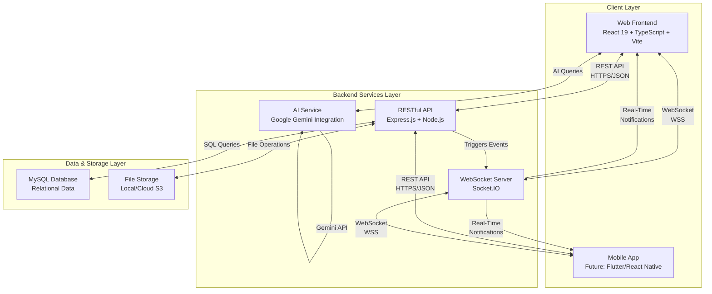

<div align="center">

# 🏥 MediConnect BD 3.0

### **Real-Time Healthcare Management Platform for Bangladesh**

[](LICENSE)
[](https://nodejs.org/)
[](https://reactjs.org/)
[](https://www.typescriptlang.org/)
[](https://socket.io/)
[](https://www.mysql.com/)
[](https://expressjs.com/)

**A comprehensive, AI-powered healthcare ecosystem connecting patients, doctors, hospital administrators, and system administrators in real-time**

[Features](#-key-features) • [Architecture](#-system-architecture) • [Quick Start](#-quick-start) • [Documentation](#-documentation) • [API Reference](#-api-endpoints)

---

</div>

## 📋 Table of Contents

- [🌟 Overview](#-overview)
- [✨ Key Features](#-key-features)
  - [Patient Portal](#-patient-portal)
  - [Doctor Portal](#-doctor-portal)
  - [Hospital Admin Portal](#-hospital-admin-portal)
  - [Super Admin Portal](#-super-admin-portal)
- [🏗️ System Architecture](#-system-architecture)
- [🛠️ Tech Stack](#️-tech-stack)
- [🚀 Quick Start](#-quick-start)
- [📂 Project Structure](#-project-structure)
- [🌐 API Endpoints](#-api-endpoints)
- [⚡ Real-Time Features](#-real-time-features)
- [🔒 Security](#-security)
- [📱 Mobile Responsiveness](#-mobile-responsiveness)
- [🧪 Testing](#-testing)
- [🗺️ Future Roadmap](#️-future-roadmap)
- [👥 Contributing](#-contributing)
- [📄 License](#-license)

---

## 🌟 Overview

**MediConnect BD 3.0** is a production-ready, full-stack healthcare management platform designed specifically for the Bangladeshi healthcare system. It revolutionizes medical service delivery by providing a unified digital ecosystem that connects all stakeholders in the healthcare journey.

### 🎯 Mission

To modernize Bangladesh's healthcare infrastructure by providing:
- **Real-time** patient-doctor connectivity
- **AI-powered** health assistance and diagnostics
- **Comprehensive** medical record management
- **Efficient** hospital resource allocation
- **Transparent** service delivery and feedback systems

### 🏆 What Makes It Special

- ✅ **100% Real-Time**: Live queue tracking, instant notifications, WebSocket-powered updates
- ✅ **Multi-Tenant Architecture**: Complete hospital isolation with role-based access control
- ✅ **AI Integration**: Google Gemini-powered health chatbot for instant medical queries
- ✅ **Mobile-First Design**: Fully responsive interface optimized for all devices
- ✅ **Production-Ready**: Comprehensive error handling, security, and scalability
- ✅ **Bangladesh-Focused**: Designed for local healthcare challenges and workflows

---

## ✨ Key Features

### 👤 Patient Portal

<details>
<summary><b>Click to expand Patient Features</b></summary>

#### 🔐 Authentication & Profile
- Secure JWT-based authentication with role-based access control
- Complete profile management with medical history
- Privacy controls for sensitive health information
- Password reset and account recovery

#### 👨‍⚕️ Doctor Discovery & Booking
- Advanced search filters (specialization, location, availability)
- Real-time doctor availability and slot management
- Detailed doctor profiles with qualifications and experience
- Instant appointment booking with confirmation
- View appointment history and manage upcoming visits

#### 📊 Health Management
- **Medical Document Hub**:
  - Upload prescriptions, lab reports, X-rays, and medical certificates
  - Secure cloud storage with download functionality
  - Doctor-shared documents with timestamp tracking
  - Privacy-controlled sharing with healthcare providers
  
- **Vitals Tracking**:
  - Record and monitor blood pressure, sugar levels, weight
  - Historical trend visualization
  - Doctor access for informed consultations

#### 🔔 Real-Time Updates
- Live queue position tracking during appointments
- Instant notifications for appointment status changes
- Real-time alerts for new medical documents
- Push notifications for important health reminders

#### ⭐ Review & Feedback
- Rate doctors after consultations
- Write detailed reviews with privacy options
- View aggregated ratings and patient testimonials
- Help others make informed healthcare decisions

#### 🚑 Emergency Services
- Quick access to emergency contacts
- Ambulance booking with live tracking
- Emergency hospital locator
- Critical health information display

#### 🤖 AI Health Assistant
- 24/7 chatbot powered by Google Gemini
- Symptom checker and preliminary diagnosis
- Health tips and medication reminders
- Natural language conversation interface

</details>

### 👨‍⚕️ Doctor Portal

<details>
<summary><b>Click to expand Doctor Features</b></summary>

#### 📅 Schedule Management
- Create and manage appointment slots
- Set availability by day, time, and duration
- Block specific dates for holidays/conferences
- Configure consultation fees and slot limits
- Real-time slot synchronization across platform

#### 👥 Patient Queue Management
- **Live Queue Dashboard**:
  - Visual queue with patient order
  - Estimated wait times for each patient
  - Mark patients as "In Consultation" or "Completed"
  - Real-time updates broadcast to waiting patients
  
- **Smart Queue Features**:
  - Auto-progression when appointments complete
  - Late arrival handling and rescheduling
  - No-show tracking and analytics

#### 📋 Patient Medical Records
- Access complete patient medical history
- View previously uploaded documents
- Upload new prescriptions and reports
- Add consultation notes and diagnoses
- Track patient vitals over time

#### 📊 Dashboard & Analytics
- Daily/weekly/monthly appointment statistics
- Patient demographics and trends
- Revenue tracking and consultation metrics
- Most common diagnoses and treatments
- Performance ratings and patient feedback

#### ⭐ Reviews & Reputation
- View all patient reviews and ratings
- Respond to patient feedback
- Track reputation score over time
- Identify areas for service improvement

#### 🔔 Notifications
- New appointment requests
- Patient check-ins and queue updates
- Urgent patient messages
- Document upload alerts

</details>

### 🏥 Hospital Admin Portal

<details>
<summary><b>Click to expand Hospital Admin Features</b></summary>

#### 🏢 Multi-Tenant Hospital Management
- **Single-Tenancy Model**: Each admin manages only their hospital
- Real-time hospital dashboard with key metrics
- Configure hospital profile and contact information

#### 👨‍⚕️ Doctor Management
- **Complete CRUD Operations**:
  - Add new doctors with detailed profiles
  - Update doctor information and credentials
  - Manage doctor schedules and availability
  - Deactivate/reactivate doctor accounts
  
- **Schedule & Slot Management**:
  - Create appointment slots for all doctors
  - Bulk slot creation for recurring schedules
  - Monitor doctor utilization rates
  - Handle slot conflicts and overlaps

#### 🏥 Resource Management
- **Hospital Bed Tracking**:
  - ICU bed availability in real-time
  - CCU (Cardiac Care Unit) monitoring
  - General ward occupancy
  - Private cabin status
  - Bed allocation and discharge tracking

- **Ambulance Fleet Management**:
  - Track all ambulances by status (available, in-service, maintenance)
  - View ambulance locations (integration-ready for GPS)
  - Assign ambulances to emergency requests
  - Monitor ambulance utilization

#### 🧪 Clinical Services
- **Department Management**:
  - Add/modify hospital departments
  - Assign doctors to departments
  - Track departmental performance
  
- **Diagnostic Test Catalog**:
  - Maintain list of available tests
  - Configure test pricing
  - Track test volumes
  - Inventory management for test kits

#### 📊 Live Queue Monitoring
- Monitor all active patient queues
- Track patient flow across departments
- Identify bottlenecks in real-time
- Export queue data for analysis

#### 📈 Analytics & Reports
- Daily admission/discharge reports
- Revenue analytics by department
- Doctor performance metrics
- Resource utilization trends
- Patient satisfaction scores

</details>

### 🔧 Super Admin Portal

<details>
<summary><b>Click to expand Super Admin Features</b></summary>

#### 🏥 Platform-Wide Management
- **Multi-Hospital Oversight**:
  - View and manage all registered hospitals
  - Approve new hospital registrations
  - Monitor hospital compliance and performance
  - Deactivate non-compliant hospitals

#### 👥 User Management
- **Cross-Platform User Administration**:
  - View all users (patients, doctors, admins)
  - Role assignment and permission management
  - Account verification and activation
  - Handle reported users and disputes
  - Bulk user operations

#### 📊 System Analytics
- **Platform-Wide Metrics**:
  - Total users, appointments, and revenue
  - Growth trends and adoption rates
  - Geographic distribution of services
  - Peak usage times and capacity planning
  
- **Performance Monitoring**:
  - API response times
  - Database query performance
  - Real-time connection statistics
  - Error logs and system health

#### 🔐 Security & Compliance
- Audit logs for all critical actions
- RBAC (Role-Based Access Control) configuration
- Data privacy compliance monitoring
- Security incident tracking

#### ⚙️ Platform Configuration
- System-wide settings and parameters
- Feature flags and A/B testing
- Maintenance mode controls
- Email and notification templates

</details>

---

## 🏗️ System Architecture

MediConnect BD 3.0 uses a modern **3-tier architecture** with real-time capabilities:



### 🔑 Architectural Highlights

#### **Decoupled Frontend & Backend**
- Independent development and deployment
- API-first design enables multiple client types
- Easy scaling of frontend and backend separately

#### **Real-Time Infrastructure**
- WebSocket connections for instant updates
- Room-based event broadcasting
- Auto-reconnection and state recovery

#### **Security by Design**
- JWT-based stateless authentication
- CORS protection with whitelist
- SQL injection prevention
- XSS and CSRF protection
- Role-based access control (RBAC)

#### **Scalability Ready**
- Horizontal scaling with load balancers
- Database connection pooling
- Redis adapter for multi-server Socket.IO
- CDN integration for static assets

---

## 🛠️ Tech Stack

### **Frontend**
| Technology | Version | Purpose |
|-----------|---------|---------|
| React | 19.2.0 | UI framework with hooks and concurrent features |
| TypeScript | 5.8.2 | Type-safe development |
| Vite | 6.2.0 | Lightning-fast build tool and dev server |
| Socket.IO Client | 4.8.1 | Real-time WebSocket communication |
| Recharts | 3.5.0 | Beautiful data visualization |
| Lucide React | 0.555.0 | Modern icon library |

### **Backend**
| Technology | Version | Purpose |
|-----------|---------|---------|
| Node.js | ≥18.0.0 | JavaScript runtime |
| Express.js | 4.21.2 | Web framework for RESTful APIs |
| MySQL2 | 3.12.0 | Database driver with prepared statements |
| Socket.IO | 4.8.1 | Real-time bidirectional communication |
| JWT | 9.0.2 | Secure authentication tokens |
| Bcrypt | 6.0.0 | Password hashing |
| Multer | 1.4.5 | Multipart file upload handling |
| Faker.js | 9.2.0 | Realistic test data generation |

### **AI & External Services**
| Service | Purpose |
|---------|---------|
| Google Gemini | AI-powered health chatbot |
| Socket.IO | Real-time notifications |

### **Development Tools**
| Tool | Purpose |
|------|---------|
| Nodemon | Backend auto-reload during development |
| ESLint | Code quality and consistency |
| Git | Version control |

---

## 🚀 Quick Start

### Prerequisites

Ensure you have the following installed:
- **Node.js** ≥ 18.x ([Download](https://nodejs.org/))
- **npm** ≥ 9.x (comes with Node.js)
- **MySQL** 8.x ([Download](https://dev.mysql.com/downloads/installer/))
- **Git** ([Download](https://git-scm.com/downloads))
- **Code Editor** (VS Code recommended)

### Installation

#### **1️⃣ Clone the Repository**
```bash
git clone https://github.com/omorfarukullas/MediConnectBD3.2.git
cd MediConnect-BD3.0
```

#### **2️⃣ Install Dependencies**

**Frontend:**
```bash
npm install
```

**Backend:**
```bash
cd backend
npm install
cd ..
```

#### **3️⃣ Database Setup**

**Create Database:**
```sql
CREATE DATABASE mediconnect CHARACTER SET utf8mb4 COLLATE utf8mb4_unicode_ci;
```

**Run Migrations:**
```bash
cd backend
node database/migrations/run_migrations.js
```

**Seed Sample Data (Optional):**
```bash
npm run seed
# or for a complete refresh:
npm run db:refresh
```

#### **4️⃣ Configure Environment Variables**

**Backend Environment (.env):**

Create `backend/.env` from the template:
```bash
cd backend
cp .env.example .env
```

Edit `backend/.env`:
```env
# Server Configuration
PORT=5000
NODE_ENV=development

# Database Configuration
DB_HOST=localhost
DB_USER=your_mysql_username
DB_PASS=your_mysql_password
DB_NAME=mediconnect
DB_PORT=3307  # or 3306 for default MySQL port

# JWT Configuration
JWT_SECRET=your_super_secret_jwt_key_change_this_in_production
JWT_EXPIRES_IN=30d

# File Upload Configuration
UPLOAD_DIR=./uploads
MAX_FILE_SIZE=10485760  # 10MB in bytes
```

**Frontend Environment (.env):**

Create `.env` in the root directory:
```env
# API Configuration
VITE_API_URL=http://localhost:5000/api
VITE_SOCKET_URL=http://localhost:5000

# AI Configuration (Optional)
VITE_GEMINI_API_KEY=your_gemini_api_key_here
```

#### **5️⃣ Create Upload Directory**

**Windows (PowerShell):**
```powershell
cd backend
mkdir uploads
```

**Linux/macOS:**
```bash
mkdir -p backend/uploads
chmod 750 backend/uploads
```

### Running the Application

You'll need **two terminal windows**:

#### **Terminal 1: Backend Server**
```bash
cd backend
npm run dev
# or for production: npm start
```
✅ Backend running at `http://localhost:5000`

#### **Terminal 2: Frontend Application**
```bash
# From root directory
npm run dev
```
✅ Frontend running at `http://localhost:3000`

### 🎉 Access the Application

Open your browser and navigate to: **http://localhost:3000**

### 👥 Test Accounts

| Role | Email | Password |
|------|-------|----------|
| **Patient** | patient@test.com | password123 |
| **Doctor** | doctor@test.com | password123 |
| **Hospital Admin** | admin@test.com | password123 |
| **Super Admin** | superadmin@test.com | password123 |

---

## 📂 Project Structure

```
MediConnect-BD3.0/
│
├── backend/                          # Backend server
│   ├── config/
│   │   └── db.js                     # Database connection configuration
│   │
│   ├── controllers/                  # Business logic
│   │   ├── userController.js         # User authentication
│   │   ├── appointmentController.js  # Appointment management
│   │   ├── doctorController.js       # Doctor operations
│   │   ├── patientController.js      # Patient operations
│   │   ├── hospitalAdminController.js
│   │   ├── reviewController.js
│   │   ├── slotController.js
│   │   ├── queueController.js
│   │   └── ...
│   │
│   ├── middleware/
│   │   ├── auth.js                   # JWT verification
│   │   └── errorHandler.js           # Global error handling
│   │
│   ├── routes/                       # API route definitions
│   │   ├── userRoutes.js
│   │   ├── appointmentRoutes.js
│   │   ├── doctorRoutes.js
│   │   ├── hospitalAdminRoutes.js
│   │   └── ...
│   │
│   ├── services/
│   │   └── notificationService.js    # Real-time notification service
│   │
│   ├── database/
│   │   ├── schema/                   # Database schema SQL files
│   │   └── migrations/               # Database migration scripts
│   │
│   ├── scripts/
│   │   ├── seeders/                  # Data seeding scripts
│   │   └── initializeDatabase.js     # Database initialization
│   │
│   ├── uploads/                      # File upload directory
│   │   └── README.md
│   │
│   ├── .env.example                  # Environment variables template
│   ├── server.js                     # Express & Socket.IO server
│   └── package.json
│
├── components/                       # Reusable React components
│   ├── AIChatbot.tsx                 # AI health assistant
│   ├── UIComponents.tsx              # Shared UI elements
│   ├── Navbar.tsx
│   ├── Footer.tsx
│   └── ...
│
├── views/                            # Main application pages
│   ├── LandingPage.tsx               # Public homepage
│   ├── PatientPortal.tsx             # Patient dashboard
│   ├── DoctorPortal.tsx              # Doctor workspace
│   ├── AdminPortal.tsx               # Hospital admin panel
│   ├── SuperAdminPortal.tsx          # System admin console
│   ├── PatientLogin.tsx
│   ├── DoctorLogin.tsx
│   ├── PatientRegistration.tsx
│   ├── DoctorRegistration.tsx
│   ├── MedicalHistory.tsx
│   ├── EmergencyView.tsx
│   └── ...
│
├── services/                         # Frontend services
│   ├── apiClient.ts                  # Axios HTTP client
│   ├── socketService.ts              # WebSocket client
│   └── geminiService.ts              # AI service integration
│
├── hooks/                            # Custom React hooks
│   └── useAuth.ts
│
├── types.ts                          # TypeScript type definitions
├── constants.ts                      # Application constants
├── utils/                            # Utility functions
│
├── App.tsx                           # Main React application
├── index.tsx                         # React entry point
├── index.html                        # HTML template
├── vite.config.ts                    # Vite configuration
├── tsconfig.json                     # TypeScript configuration
├── package.json                      # Frontend dependencies
└── README.md                         # This file
```

---

## 🌐 API Endpoints

### 🔐 Authentication
| Method | Endpoint | Description | Auth Required |
|--------|----------|-------------|---------------|
| POST | `/api/auth/register` | Register new user | ❌ |
| POST | `/api/auth/login` | User login | ❌ |
| GET | `/api/auth/me` | Get current user | ✅ |
| PUT | `/api/auth/password` | Update password | ✅ |

### 👤 Patient Endpoints
| Method | Endpoint | Description | Auth Required |
|--------|----------|-------------|---------------|
| GET | `/api/patients/profile` | Get patient profile | ✅ |
| PUT | `/api/patients/profile` | Update patient profile | ✅ |
| GET | `/api/patients/appointments` | Get appointments | ✅ |
| POST | `/api/patients/appointments` | Book appointment | ✅ |
| DELETE | `/api/patients/appointments/:id` | Cancel appointment | ✅ |
| GET | `/api/patients/medical-history` | Get medical records | ✅ |
| POST | `/api/patients/documents/upload` | Upload document | ✅ |
| GET | `/api/patients/documents/:id` | Download document | ✅ |

### 👨‍⚕️ Doctor Endpoints
| Method | Endpoint | Description | Auth Required |
|--------|----------|-------------|---------------|
| GET | `/api/doctors` | Search doctors | ❌ |
| GET | `/api/doctors/:id` | Get doctor details | ❌ |
| GET | `/api/doctors/:id/slots` | Get available slots | ❌ |
| PUT | `/api/doctors/profile` | Update profile | ✅ |
| GET | `/api/doctors/appointments` | Get appointments | ✅ |
| POST | `/api/doctors/slots` | Create appointment slot | ✅ |
| DELETE | `/api/doctors/slots/:id` | Delete slot | ✅ |
| GET | `/api/doctors/queue` | Get patient queue | ✅ |
| PUT | `/api/doctors/queue/:id` | Update queue status | ✅ |

### 🏥 Hospital Admin Endpoints
| Method | Endpoint | Description | Auth Required |
|--------|----------|-------------|---------------|
| GET | `/api/admin/hospital` | Get hospital details | ✅ |
| GET | `/api/admin/doctors` | Get hospital doctors | ✅ |
| POST | `/api/admin/doctors` | Add new doctor | ✅ |
| PUT | `/api/admin/doctors/:id` | Update doctor | ✅ |
| DELETE | `/api/admin/doctors/:id` | Remove doctor | ✅ |
| GET | `/api/admin/resources` | Get hospital resources | ✅ |
| PUT | `/api/admin/resources` | Update resources | ✅ |
| GET | `/api/admin/departments` | Get departments | ✅ |
| POST | `/api/admin/departments` | Add department | ✅ |
| GET | `/api/admin/ambulances` | Get ambulances | ✅ |
| PUT | `/api/admin/ambulances/:id` | Update ambulance status | ✅ |

### 🔧 Super Admin Endpoints
| Method | Endpoint | Description | Auth Required |
|--------|----------|-------------|---------------|
| GET | `/api/superadmin/users` | Get all users | ✅ |
| GET | `/api/superadmin/hospitals` | Get all hospitals | ✅ |
| PUT | `/api/superadmin/hospitals/:id/approve` | Approve hospital | ✅ |
| GET | `/api/superadmin/analytics` | Platform analytics | ✅ |
| GET | `/api/superadmin/audit-logs` | System audit logs | ✅ |

### ⭐ Review Endpoints
| Method | Endpoint | Description | Auth Required |
|--------|----------|-------------|---------------|
| POST | `/api/reviews` | Submit review | ✅ |
| GET | `/api/reviews/doctor/:id` | Get doctor reviews | ❌ |
| PUT | `/api/reviews/:id` | Update review | ✅ |
| DELETE | `/api/reviews/:id` | Delete review | ✅ |

> 📚 **Complete API Documentation**: See [backend/API_TESTING.md](backend/API_TESTING.md) for detailed request/response examples

---

## ⚡ Real-Time Features

MediConnect BD uses **Socket.IO** for real-time bidirectional communication:

### 🔌 Connection Flow

```javascript
// Client connects with JWT token
const socket = io('http://localhost:5000', {
  auth: { token: localStorage.getItem('token') }
});

// Server authenticates and assigns to rooms
socket.on('connect', () => {
  console.log('Connected to real-time server');
});
```

### 📡 Event Types

#### **Notification Events**
```javascript
// Generic notification event
{
  type: 'notification',
  data: {
    title: 'Appointment Confirmed',
    message: 'Your appointment with Dr. Smith is confirmed',
    timestamp: '2026-02-01T01:15:00Z',
    action: 'view_appointment'
  }
}
```

#### **Queue Update Events**
```javascript
// Queue position update
{
  type: 'queue_updated',
  data: {
    appointmentId: 123,
    position: 2,
    estimatedWaitTime: '15 minutes',
    status: 'WAITING'
  }
}
```

#### **Document Upload Events**
```javascript
// New document notification
{
  type: 'document_uploaded',
  data: {
    documentId: 456,
    type: 'PRESCRIPTION',
    uploadedBy: 'Dr. Ahmed',
    timestamp: '2026-02-01T01:20:00Z'
  }
}
```

### 🏠 Room Architecture

- **User Rooms**: `user_{userId}` - Personal notifications
- **Queue Rooms**: `queue_{doctorId}` - Live queue updates
- **Hospital Rooms**: `hospital_{hospitalId}` - Hospital-wide broadcasts

---

## 🔒 Security

MediConnect BD implements multiple layers of security:

### 🛡️ Security Features

#### **Authentication & Authorization**
- ✅ JWT-based stateless authentication
- ✅ Bcrypt password hashing (10 rounds)
- ✅ Role-based access control (RBAC)
- ✅ Token expiration and refresh logic
- ✅ Secure session management

#### **Data Protection**
- ✅ SQL injection prevention (parameterized queries)
- ✅ XSS protection (input sanitization)
- ✅ CSRF token validation
- ✅ CORS whitelist configuration
- ✅ Rate limiting on sensitive endpoints

#### **File Security**
- ✅ File type validation (whitelist)
- ✅ File size limits (10MB default)
- ✅ Secure file naming (UUID + timestamp)
- ✅ Access control for file downloads
- ✅ Virus scanning (production recommendation)

#### **Privacy & Compliance**
- ✅ Patient data privacy controls
- ✅ HIPAA-aligned data handling
- ✅ Audit logging for sensitive operations
- ✅ Data retention policies
- ✅ Right to erasure support

### 🔐 Environment Security Checklist

Before deploying to production:

- [ ] Change all default passwords
- [ ] Use strong JWT secret (32+ random characters)
- [ ] Enable HTTPS/SSL certificates
- [ ] Configure firewall rules
- [ ] Enable database SSL connections
- [ ] Set secure cookie flags
- [ ] Implement rate limiting
- [ ] Enable audit logging
- [ ] Regular security audits
- [ ] Dependency vulnerability scanning

---

## 📱 Mobile Responsiveness

MediConnect BD 3.0 is **fully responsive** and optimized for all devices:

### 📐 Breakpoints

| Device | Viewport | Optimizations |
|--------|----------|---------------|
| 📱 Mobile | < 640px | Single column, touch-optimized, condensed navigation |
| 📱 Tablet | 640px - 1024px | Two-column layout, adaptive menus |
| 💻 Desktop | > 1024px | Full multi-column, sidebar navigation |
| 🖥️ Large Desktop | > 1440px | Enhanced spacing, larger data tables |

### ✨ Mobile Features

- ✅ Touch-friendly UI elements (min 44x44px tap targets)
- ✅ Swipe gestures for navigation
- ✅ Responsive data tables (horizontal scroll + cards)
- ✅ Mobile-optimized forms (proper input types)
- ✅ Adaptive images and icons
- ✅ Fast load times (<3s on 3G)

---

## 🧪 Testing

### Manual Testing

**Full System Testing Guide**: See [TESTING_GUIDE.md](TESTING_GUIDE.md)

**Backend API Testing**: See [backend/API_TESTING.md](backend/API_TESTING.md)

### Test Coverage

- ✅ User authentication flows
- ✅ Appointment booking and management
- ✅ Real-time queue updates
- ✅ Medical document upload/download
- ✅ Multi-tenant isolation
- ✅ Role-based access control
- ✅ Error handling and edge cases

### Running Tests

```bash
# Backend API tests (manual with provided scripts)
cd backend
npm run test:api

# Database integrity tests
npm run test:db

# End-to-end testing (future implementation)
npm run test:e2e
```

---

## 🗺️ Future Roadmap

### 🚀 Upcoming Features

#### **Phase 1: Enhanced Communication** (Q2 2026)
- [ ] In-app messaging between patients and doctors
- [ ] Video consultation (WebRTC integration)
- [ ] Voice call functionality
- [ ] Chat history and file sharing

#### **Phase 2: Advanced AI** (Q3 2026)
- [ ] AI-powered symptom analysis
- [ ] Drug interaction checker
- [ ] Personalized health recommendations
- [ ] Medical image analysis (X-ray, MRI)

#### **Phase 3: Payment Integration** (Q3 2026)
- [ ] SSLCommerz payment gateway
- [ ] bKash/Nagad mobile payments
- [ ] Online consultation fees
- [ ] Insurance claim integration

#### **Phase 4: Mobile Applications** (Q4 2026)
- [ ] Native Android app (Flutter)
- [ ] Native iOS app (Flutter)
- [ ] Push notifications
- [ ] Offline mode support

#### **Phase 5: Advanced Analytics** (Q1 2027)
- [ ] Predictive analytics for hospital management
- [ ] Patient risk stratification
- [ ] Resource optimization AI
- [ ] Epidemic tracking and alerts

### 🌍 Deployment Plans

- **Infrastructure**: AWS/Azure/DigitalOcean
- **Database**: Managed MySQL (RDS/CloudSQL)
- **File Storage**: AWS S3 or Azure Blob
- **CDN**: CloudFront/CloudFlare
- **CI/CD**: GitHub Actions + Docker
- **Monitoring**: New Relic/DataDog
- **Scaling**: Redis for Socket.IO, load balancers

---

## 👥 Contributing

We welcome contributions! Here's how you can help:

### 🤝 How to Contribute

1. **Fork the Repository**
   ```bash
   git clone https://github.com/omorfarukullas/MediConnectBD3.2.git
   ```

2. **Create a Feature Branch**
   ```bash
   git checkout -b feature/your-amazing-feature
   ```

3. **Make Your Changes**
   - Follow existing code style
   - Add comments for complex logic
   - Update documentation if needed

4. **Test Your Changes**
   - Ensure all existing features work
   - Test on multiple devices/browsers
   - Check for console errors

5. **Commit Your Changes**
   ```bash
   git commit -m "Add: Your feature description"
   ```

6. **Push to Your Fork**
   ```bash
   git push origin feature/your-amazing-feature
   ```

7. **Open a Pull Request**
   - Describe your changes clearly
   - Reference any related issues
   - Wait for review and feedback

### 📋 Contribution Guidelines

- Write clean, readable code
- Follow TypeScript best practices
- Add JSDoc comments for functions
- Maintain responsive design
- Test across different roles (patient, doctor, admin)
- Update README if adding new features

---

## 📄 License

This project is licensed under the **MIT License**.

```
MIT License

Copyright (c) 2026 Omor Faruk Ullah

Permission is hereby granted, free of charge, to any person obtaining a copy
of this software and associated documentation files (the "Software"), to deal
in the Software without restriction, including without limitation the rights
to use, copy, modify, merge, publish, distribute, sublicense, and/or sell
copies of the Software, and to permit persons to whom the Software is
furnished to do so, subject to the following conditions:

The above copyright notice and this permission notice shall be included in all
copies or substantial portions of the Software.

THE SOFTWARE IS PROVIDED "AS IS", WITHOUT WARRANTY OF ANY KIND, EXPRESS OR
IMPLIED, INCLUDING BUT NOT LIMITED TO THE WARRANTIES OF MERCHANTABILITY,
FITNESS FOR A PARTICULAR PURPOSE AND NONINFRINGEMENT. IN NO EVENT SHALL THE
AUTHORS OR COPYRIGHT HOLDERS BE LIABLE FOR ANY CLAIM, DAMAGES OR OTHER
LIABILITY, WHETHER IN AN ACTION OF CONTRACT, TORT OR OTHERWISE, ARISING FROM,
OUT OF OR IN CONNECTION WITH THE SOFTWARE OR THE USE OR OTHER DEALINGS IN THE
SOFTWARE.
```

---

<div align="center">

## 🌟 Show Your Support

If you find this project helpful, please consider giving it a ⭐️ on GitHub!

### 📧 Contact & Support

**Project Maintainer**: Omor Faruk Ullah

- 📧 Email: [your-email@example.com]
- 🐙 GitHub: [@omorfarukullas](https://github.com/omorfarukullas)
- 💼 LinkedIn: [Your LinkedIn Profile]

---

### 🙏 Acknowledgments

- Google Gemini AI for intelligent health assistance
- Socket.IO team for real-time infrastructure
- React and TypeScript communities
- All contributors and testers

---

**Made with ❤️ for the people of Bangladesh**

**Building a healthier tomorrow, today.**

</div>
