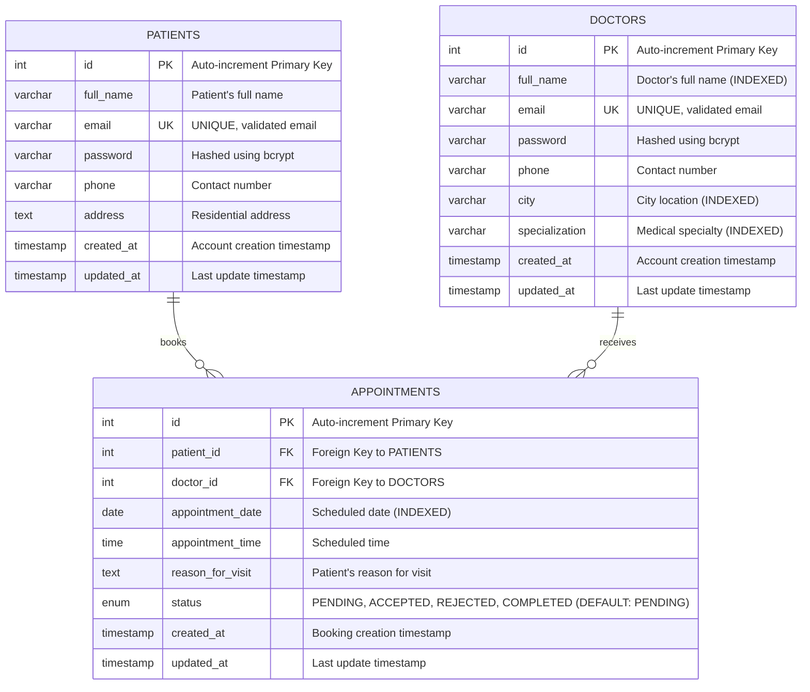

# Entity Relationship Diagram (ERD)
## Doctor-Patient Appointment System

This diagram illustrates the database schema for the Doctor-Patient Appointment System, showing the normalized relational structure between Patients, Doctors, and Appointments.

## Mermaid.js ER Diagram



---

## Relationship Descriptions

### 1. **PATIENTS → APPOINTMENTS** (One-to-Many)
- **Cardinality:** One patient can have multiple appointments (0 to many).
- **Foreign Key:** `appointments.patient_id` references `patients.id`.
- **Cascade:** `ON DELETE CASCADE` ensures when a patient is deleted, all their appointments are removed.

### 2. **DOCTORS → APPOINTMENTS** (One-to-Many)
- **Cardinality:** One doctor can have multiple appointments (0 to many).
- **Foreign Key:** `appointments.doctor_id` references `doctors.id`.
- **Cascade:** `ON DELETE CASCADE` ensures when a doctor is deleted, all their appointments are removed.

### 3. **Double Booking Prevention**
- **Unique Constraint:** `(doctor_id, appointment_date, appointment_time)` ensures no two appointments can be scheduled for the same doctor at the same date and time.

---

## Key Features

### Normalization (3NF Compliance)
- ✅ No repeating groups (each field is atomic).
- ✅ No partial dependencies (all non-key attributes depend on the entire primary key).
- ✅ No transitive dependencies (non-key attributes depend only on the primary key).

### Performance Optimization
- **Indexed Fields:**
  - `doctors.city` - Fast city-based searches.
  - `doctors.specialization` - Fast specialization-based searches.
  - `doctors.full_name` - Fast name-based searches.
  - `appointments.appointment_date` - Fast date-range queries.
  - `appointments.status` - Fast filtering by appointment status.

### Data Integrity
- **UNIQUE Constraints:** Prevent duplicate emails for both patients and doctors.
- **ENUM Status:** Restricts appointment status to predefined values: `PENDING`, `ACCEPTED`, `REJECTED`, `COMPLETED`.
- **Foreign Keys:** Enforce referential integrity with cascade operations.
- **CHECK Constraints:** Email format validation using regex patterns.

---

## Sample Queries for Faculty Presentation

### Search Doctors by City
```sql
SELECT * FROM doctors WHERE city = 'New York';
```

### Search Doctors by Specialization
```sql
SELECT * FROM doctors WHERE specialization = 'Cardiologist';
```

### Get Patient's Appointment History
```sql
SELECT 
    a.id,
    a.appointment_date,
    a.appointment_time,
    a.status,
    d.full_name AS doctor_name,
    d.specialization
FROM appointments a
JOIN doctors d ON a.doctor_id = d.id
WHERE a.patient_id = 1
ORDER BY a.appointment_date DESC;
```

### Check Doctor's Schedule for a Specific Date
```sql
SELECT 
    a.appointment_time,
    a.status,
    p.full_name AS patient_name,
    a.reason_for_visit
FROM appointments a
JOIN patients p ON a.patient_id = p.id
WHERE a.doctor_id = 1 
  AND a.appointment_date = '2026-01-20'
ORDER BY a.appointment_time;
```

---

## Database Technology Stack
- **RDBMS:** MySQL 5.7+ or PostgreSQL 12+
- **ORM:** Sequelize (Node.js)
- **Character Set:** UTF8MB4 (supports emojis and international characters)
- **Storage Engine:** InnoDB (supports transactions and foreign keys)

---

**Prepared for:** University Project Presentation  
**Date:** January 12, 2026  
**Schema Version:** 1.0
